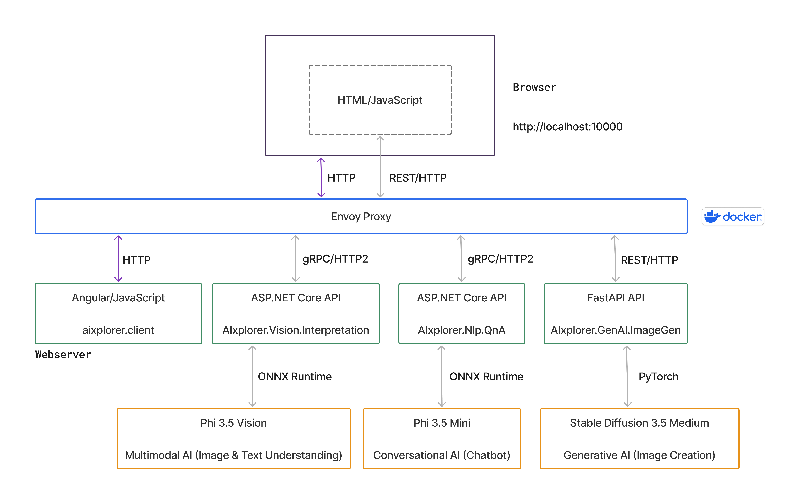

# AIxplorer



## Screenshots

Check out the [screenshots](./screenshots.md) for a visual overview.

## Project Overview

**AIxplorer** is a demo application showcasing the integration of artificial intelligence (AI) in a modern web environment.  
The project consists of an Angular-based frontend (aixplorer.client) and multiple microservices (ASP.NET Core, FastAPI) that interact with AI models such as Phi-3.5 and Stable Diffusion.  

The application supports:  
- **Image analysis, interpretation, and recognition**  
- **Natural language processing (NLP) chat**  
- **Text-to-image generation**  

> **Note:**  
> 
> This project is for demonstration purposes only and is not intended for production use.  
> HTTP (not HTTPS) is used for communication between components within a trusted network, such as the Envoy proxy and microservices, where TLS encryption is not necessary.  
> However, for production use, it's crucial to secure the connection between the user and the Angular app, as well as potentially between Angular and the Envoy proxy, using HTTPS 
> and proper encryption.  
> Furthermore, for a production-grade application, additional improvements are necessary, such as secure authentication, centralized logging, and robust error handling.  
> 
> The AI models are not included in this repository. They can be downloaded from Hugging Face. For details, see [Download AI Models](#download-ai-models).  
> Additionally, while this project currently integrates Phi-3.5 and Stable Diffusion models, other AI models can also be integrated as long as the existing interfaces 
> are compatible with the new models or can be adapted. The integration process has been tested with the mentioned models but can be extended to include other models based 
> on the requirements of your application.
>
> Future updates will primarily focus on refactoring efforts, such as addressing compiler warnings and improving code comments. See the [TODO List](#todo-list) for planned 
> improvements.

### Key Components

1. **`aixplorer.client` (Angular)**  
   The **frontend** of the application, built with Angular, providing a simple and intuitive UI for interacting with AI-driven services.  

2. **`AIxplorer.Proxy` (Envoy Proxy)**  
   [Envoy Proxy](https://www.envoyproxy.io/) is used as a gateway to route requests between services efficiently.  

3. **`AIxplorer.Vision.Interpretation` (ASP.NET Core)**  
   A **computer vision service** that handles **image analysis and interpretation**.  
   - **Developed and tested using Phi-3.5 Vision**.  

4. **`AIxplorer.Nlp.QnA` (ASP.NET Core)**  
   An **NLP chatbot** capable of answering questions and engaging in contextual conversations.  
   - **Developed and tested using Phi-3.5 Mini**.  

5. **`AIxplorer.GenAI.ImageGen` (FastAPI, Python)**  
   An **AI-based image generation service** using the **Stable Diffusion** model to create images from text prompts.  
   - **Developed and tested using Stable Diffusion 3.5 Medium**.  

## Prerequisites

- [.NET 9 SDK](https://dotnet.microsoft.com/download/dotnet/9.0)
- [Visual Studio 2022](https://visualstudio.microsoft.com/vs/) or [Visual Studio Code](https://code.visualstudio.com/)
- [Docker](https://www.docker.com/)
- [Python](#python-setup-instructions-windows)
- [Protocol Buffer Compiler](https://grpc.io/docs/protoc-installation/) (optional, for generation of new descriptor sets for Envoy)

### Python Setup Instructions (Windows)

1. Install Python  
   Make sure you have Python 3.9 or later installed. You can download it from [python.org](https://www.python.org/downloads/windows/).

2. Navigate to the Project Folder
   
    ```
    cd src\AIxplorer.GenAI.ImageGen
    ```

3. Create a Virtual Environment  
   It is recommended to use a virtual environment to manage dependencies. Run the following commands:
   ```
   python -m venv imagegen_env
   ```

4. Activate the Virtual Environment
   
     ```
     .\imagegen_env\Scripts\activate
     ```

5. Install Dependencies
   Install the required Python libraries from the `requirements.txt` file:
   ```
   pip install -r requirements.txt
   ```

## Getting Started

### Clone the repository:

```
git clone https://github.com/jasdvl/demo-aspnetcore-fastapi-ai.git
```

### Download AI models

Stable Diffusion 3.5 Medium (~ 80 GB)

```git clone https://huggingface.co/stabilityai/stable-diffusion-3.5-medium```

Phi 3.5 Vision (~ 10 GB)

```git clone https://huggingface.co/microsoft/Phi-3.5-vision-instruct```

Phi 3.5 Mini (~ 10 GB)

```git clone https://huggingface.co/microsoft/Phi-3.5-mini-instruct```

### Configure model paths

1. **AIxplorer.GenAI.ImageGen**
   
   Rename ```.env.example``` to ```.env```. Set the Stable Diffusion model path and adjust the server host and port to suit your needs.  
   
2. **AIxplorer.Vision.Interpretation (ASP.NET Core)**
   
   Adjust the ```ModelPath``` setting in ```appsettings.Development.json```.

3. **AIxplorer.Nlp.QnA (ASP.NET Core)**
   
   Adjust the ```ModelPath``` setting in ```appsettings.Development.json```.

### Start the Application

1. Start the Envoy Proxy
   
   Open a new terminal window and navigate to the Envoy project directory:

    ```bash
    cd demo-aspnetcore-fastapi-ai/src/AIxplorer.Proxy
    ```

   Pull the Envoy Docker image and start the Envoy proxy with the custom configuration file. In a new terminal window, run the following commands:  
   
    ```
    docker pull envoyproxy/envoy:v1.33-latest
    ```

    Start the Envoy proxy:

    ```
    docker run --rm -it ^
    -v %cd%\envoy-custom.yaml:/etc/envoy/envoy.yaml ^
    -v %cd%\grpc_service_descriptors.pb:/etc/envoy/grpc_service_descriptors.pb ^
    -p 9901:9901 -p 10000:10000 ^
    --name envoy-v1.33 envoyproxy/envoy:v1.33-latest ^
    -c /etc/envoy/envoy.yaml --log-level debug
    ```

    This will start the Envoy proxy and bind it to ports 9901 and 10000, with the configuration specified in envoy-custom.yaml.

2. Navigate to the Angular frontend directory, install dependencies, and start the Angular application:

    ```bash
    cd ../aixplorer.client
    npm install
    ng serve
    ```

   This will start the Angular frontend on `http://localhost:4200` by default.

3. Navigate to the **AIxplorer.Vision.Interpretation** and **AIxplorer.Nlp.QnA** directories and restore the project dependencies:

    ```bash
    cd ../AIxplorer.Vision.Interpretation
    dotnet restore
    dotnet run  
    ```

    ```bash
    cd ../AIxplorer.Nlp.QnA
    dotnet restore
    dotnet run  
    ```

    This will start the ASP.NET Core microservices, accessible at `https://localhost:5220` and `https://localhost:5230`.

4. Navigate to the **AIxplorer.GenAI.ImageGen** directory and start the FastAPI application using Uvicorn:
   
    ```
    cd ..\AIxplorer.GenAI.ImageGen
    ```

    ```
    uvicorn app.main:app --host 0.0.0.0 --port 7600 --reload --log-level debug
    ```

    This will start the FastAPI service on `http://localhost:7600`.

## Creating a proto descriptor set

When modifying or adding `.proto` files, it's important to update the protobuf descriptor set for Envoy to ensure proper routing and processing of gRPC requests.  
Follow these steps to do so:

1. Navigate to the `src` directory:

    ```bash
    cd demo-aspnetcore-fastapi-ai/src
    ```

2. Generate the updated `.proto` descriptor set by running the following `protoc` command:
   
    ```
    protoc -I.\AIxplorer.Grpc.Contracts --include_imports --include_source_info ^
    --descriptor_set_out=.\AIxplorer.Proxy\grpc_service_descriptors.pb ^
    .\AIxplorer.Grpc.Contracts\computer_vision\image_interpretation_service.proto ^
    .\AIxplorer.Grpc.Contracts\nlp\question_answering_service.proto
    ```

> **Note:** For further information, refer to the Envoy documentation on the [gRPC-JSON Transcoder Filter](https://www.envoyproxy.io/docs/envoy/latest/configuration/http/http_filters/grpc_json_transcoder_filter).

### Note on Google Protobuf Files

To simplify handling, the Google Protobuf files (`annotations.proto` and `http.proto`) have been copied directly into the `AIxplorer.Grpc.Contracts` C# library. While this approach makes the integration straightforward, it is not considered clean or maintainable for larger projects.
A better alternative would be to reference these files from a centralized location, such as a local clone of the official Google APIs repository.
This would provide better maintainability and alignment with best practices.


## TODO List

- Fix compiler warnings
- Add comments where they are still missing

## Branching Strategy

Since I am the sole developer on this project, I primarily work on the `main` branch. I prefer to keep things simple by committing directly to `main` for most tasks. However, if a new feature requires multiple related commits or substantial changes, I will create feature branches to manage those updates. Once the feature is complete, the branch will be merged back into `main`. My goal is to keep the main branch stable and up to date.
